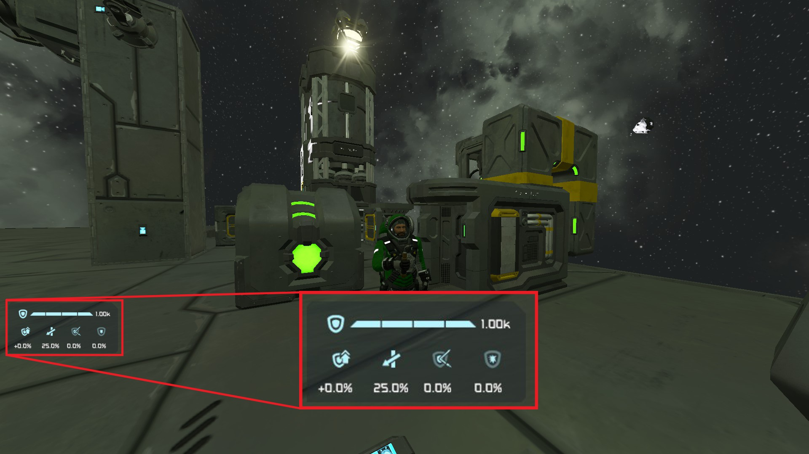

This is the official repository for Pocket Shield mod for Keen Software House's "Space Engineers" game.\
This mod will be a part of my "Back to the reality" modpack? challenge?, in which the Engineer stays on Earthlike planet most of their time.

# Pocket Shield

This mod add a personal shield generator, Pocket Shield, to character.\
Any characters (Enginners, Wolves, Spiders, AI Enabled Bots, ...) can benefit from this shield if they have the Shield Emitter item in their inventory.

Functionality is powered by [Pocket Shield Core](https://github.com/3x3y3z3t/Pocket-Shield-Core)

Link to mod: [Steam](https://steamcommunity.com/sharedfiles/filedetails/?id=2656470280)

# Notes
- **This mod may break your server**. I don't play MP so I can not test for bugs on MP/DS. Many thanks if you sacrifice your server and report me MP/DS bugs (I may not be able to fix them though).

# Version
Current version: v3.0.6
